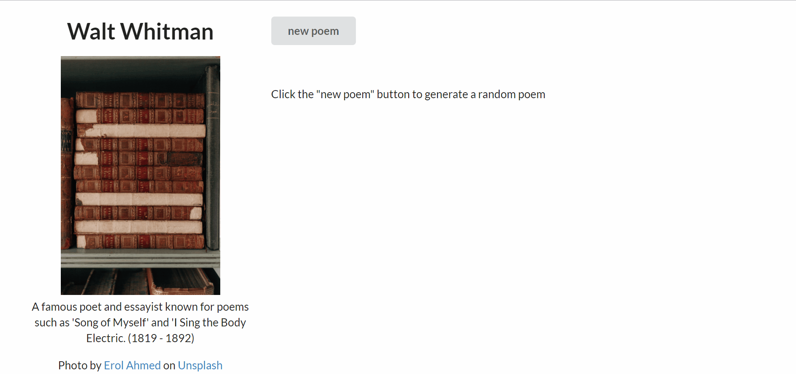
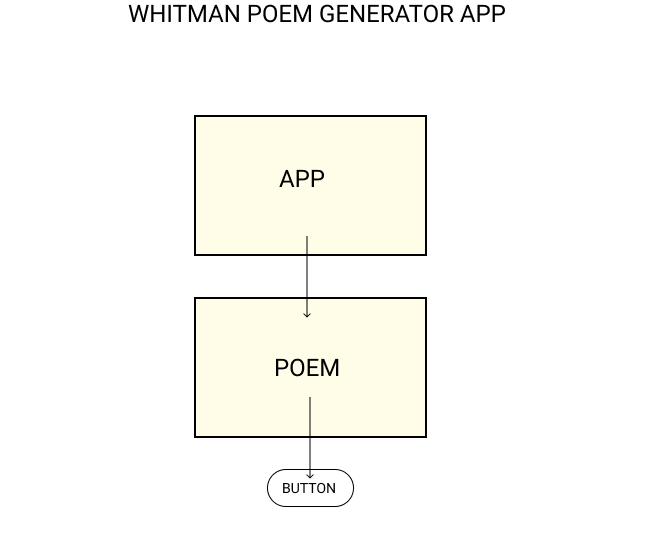

## Walt Whitman Random Poem Generator




### Description :
This is a small application to allow the user to get a random poem every time they click a button. I chose Walt Whitman because he's one of my favorite poets, but in the future, I would like to add several poets and give the user the ability to change authors using a dropdown UI. 
<br/>

This project was bootstrapped with [Create React App](https://github.com/facebook/create-react-app).  
<br/>  

### Setup :

If you would like this project on your local machine
1. Select the green `Code` button in the upper right of the github repository and copy the key (HTTPS or SSH)
2. Open your prefered text editor or EDI
3. Open the terminal
4. Enter `git clone [copied-github-key]`
5. After the project is cloned to your local machine navigate into the project by entering `cd poem-generator` into the terminal
6. Install the necessary dependencies by running `npm install` in the terminal.

Getting your API Key
**Rapid API Walt Whitman Poems API** 
1. Go to [Rapid API Walt Whitman Poem API](https://rapidapi.com/pafmon/api/walt-whitman-poems) and create an account
2. Once you have created an account, navigate to `Walt Whitman Poems API Documentation` and select the `endpoints` link
3. In the `Code Snippets` section, choose `JavaScript` --> `Axios` as the language
4. Copy the API key provided in the `Code Snippets` section

To add an API Key to the project
1. Add a file to the project's root directory and name the file `.env`
2. Add the following content to the file, replacing [API-KEY] with your own API key from the previous steps
```
REACT_APP_API_KEY=[API-KEY]

```
3. You may need to enter `npm run build` into the terminal
4. To view the project in the browser and generate random poems, enter `npm run start` into the terminal

### Known Bugs :
1. On first click of `new poem` button, initial message disappears, no title or poem are rendered - likely issue with useEffect or onButtonClick - page rerendering?

### Future Goals :
* Consider replacing button with search field 
* Add option to switch Author / Poet
* Update position of button so that user does not have to scroll to bottom of page when poem is longer
<br />  

### Tools & Technology :
* CSS
* React
* Axios library
* Rapid API
* Git & Github
* VS Code
* [Semantic-ui](https://semantic-ui.com/views/card.html)  
<br/>
